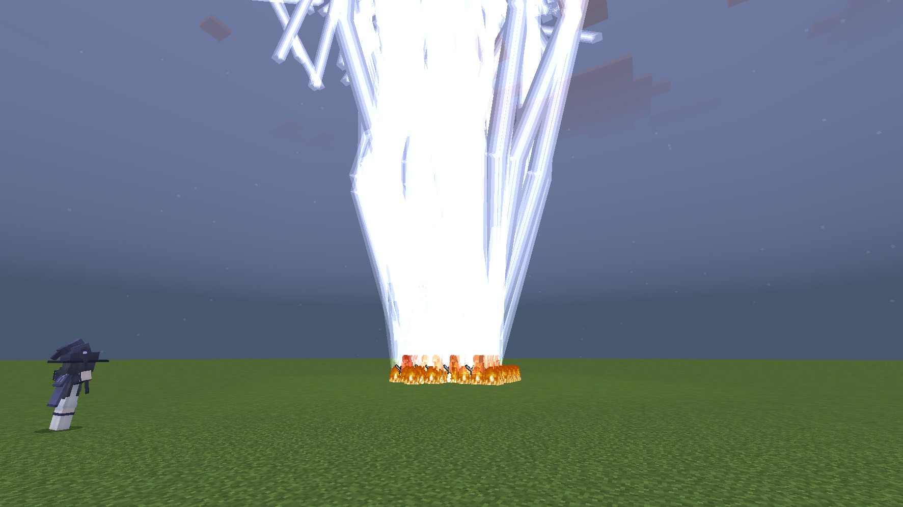

# ⚔️ Fictoria_Impact

A Minecraft Bedrock Edition battlefield combat framework.

Fictoria_Impact is not just a simple entity AI project. It provides snapshot-based targeting, spatial-hash enemy scanning, unified impulse movement, melee survival prediction, multi-track tactical clock scheduling, pressure-based support aggro, tactical patrol commands, and Pokémon-style entity capture.

The project is designed to keep large-scale entity battles stable. In testing, hundreds of enemy and friendly entities can remain active at the same time without obvious lag.

> The legacy 2022 high-frequency JSON timer architecture has been retired in 2026.  
> The new architecture uses centralized JavaScript clocks, shared enemy snapshots, and ActiveMovers unified drive.

---

## 📘 Tutorial

[Introduction](docs/Images/tutorial.md)

---

## ✨ Recent Updates

- **Upgraded to Script API 2.7.0**
  - Core scripts now target `@minecraft/server 2.7.0`.
  - UI systems now target `@minecraft/server-ui 2.0.0`.

- **Retired the Legacy 2022 JSON Timer Architecture**
  - The old 0.1-second looping JSON timer + scoreboard increment pattern has been removed from the modern skill pipeline.
  - Skill timing is now handled by the JavaScript multi-track Tactical Clock system.
  - Latest entities such as `Kirito.json` use `dm_scores` and `dm_scores_1` clock events instead of legacy high-frequency timers.

- **Large-Scale Entity Format Upgrade**
  - A large portion of entity JSON files has been upgraded to `format_version: 1.21.50`.
  - `Kirito.json` is one of the latest reference templates.

- **Unified ActiveMovers Drive**
  - `main.js` no longer scans dimensions or entity types every tick.
  - It only iterates active units registered in `ActiveMovers`.
  - Each active entity receives one impulse per tick.

- **Enemy Snapshot Targeting**
  - Each dimension builds one shared enemy snapshot every 5 ticks.
  - Enemies are indexed into spatial buckets when the count is high.
  - Units no longer perform expensive individual `getEntities()` queries for nearby monsters.

- **Melee Movement Engine v2.27**
  - EWMA threat tracking.
  - Damage-cycle prediction.
  - Block charges and parry-style damage cancellation.
  - Aggressive / balanced / emergency retreat behavior.
  - Terrain safety: cliff, pit, lava, wall, and step detection.
  - Stuck detection and safe teleport recovery.

- **Support / Bodyguard System**
  - Pressure-based support evaluation.
  - Hurt-triggered support calls.
  - Monster aggro locks.
  - Silent taunt and target transfer.
  - Support target handoff when the original monster dies.

- **Fictoria UI and Fictoria Ball**
  - Tactical command UI with follow / random / patrol modes.
  - Patrol state persists across world reload.
  - Pokémon-style entity capture with inventory, enchantment, variant, skin, and tactical state preservation.

---

## 📦 Overview

| Item | Value |
|---|---|
| Behavior Pack Entities | 98+ |
| Entity JSON Footprint | ~2.28 MB in `entities/` |
| Animation Controllers | 167 |
| Core JS Modules | 10+ |
| Script API | `@minecraft/server 2.7.0` |
| UI API | `@minecraft/server-ui 2.0.0` |
| Entity Format Migration | Large-scale upgrade to `format_version: 1.21.50` |
| License | MIT |
| Target Bedrock Version | Bedrock build supporting SAPI 2.7.0 |

---

## 🧠 Architecture

Fictoria_Impact uses a layered battlefield architecture.

```text
Layer 1: JSON Data Layer
  Entity definitions, component groups, events, variants, taming, damage rules.

Layer 2: Animation Controller Layer
  Weapon states, skill states, scoreboard-driven tags, visual effects.

Layer 3: JavaScript Battlefield Engine
  DmTargetEngine, TacticalClockManager, DmSupportModule, movement engines, ActiveMovers.

Layer 4: Player Systems
  Tactical UI, patrol commands, Fictoria Ball capture, inventory serialization.
```

The design philosophy is:

> JSON handles data, events, and animation states.  
> JavaScript handles runtime decisions, performance-critical scanning, scheduling, support logic, and battlefield coordination.  
> They cooperate instead of fighting for control.

---

## 🚀 Performance Architecture

Fictoria_Impact is built to remain stable even when many friendly and enemy entities are active at the same time.

### Enemy Snapshot

Instead of every unit calling:

```js
dimension.getEntities({
    location: unit.location,
    maxDistance: range,
    families: ["monster"]
});
```

the engine builds one shared enemy snapshot per dimension.

Snapshot behavior:

- Scan anchors are created from player positions.
- Anchors are merged into 32-block cells.
- A maximum of 24 anchors are used per dimension.
- Default snapshot radius is 96 blocks.
- Enemies are collected once and shared by all registered DM units.
- If enemy count is low, the snapshot returns a simple array.
- If enemy count is high, enemies are indexed into 24-block spatial buckets.

This dramatically reduces repeated `getEntities()` calls.

---

### Spatial Hash Buckets

When the number of enemies is large, the snapshot indexes them into spatial buckets:

```text
enemy position / 24 → bucket key
```

Units only query nearby buckets instead of scanning all enemies.

---

### ActiveMovers Unified Drive

In the old architecture, `main.js` iterated dimensions and target entity types every tick.

That design had several serious problems:

- The same entity could be queried multiple times per tick.
- The same DynamicProperties could be read multiple times per tick.
- The same entity could receive multiple `applyImpulse()` calls per tick.
- Physics load increased dramatically as entity count grew.

Diagnostic logs once showed:

```text
ticks = 40
active = 1360
```

This meant roughly:

```text
1360 / 40 = 34 effective drives per tick
```

In other words, a single unit could be driven about 34 times per tick.

The new architecture completely removes type scanning from the main drive loop.

```text
AI / movement engine writes velocity commands
  ↓
Units with active velocity are registered into ActiveMovers
  ↓
main.js iterates ActiveMovers only
  ↓
Each active unit receives one impulse per tick
```

Now `main.js` does not query DM entities by type every tick.  
It only processes entities that are currently moving.

---

### Legacy Impulse Compensation

Because the old system accidentally drove entities many times per tick, the new system uses a calibrated multiplier:

```js
const LEGACY_IMPULSE_MULTIPLIER = 34;
```

This preserves the old movement feel while removing the underlying duplicate-drive waste.

The long-term goal is to gradually reduce this multiplier and retune entity speed configurations.

---

### Non-Combat Interception

Units without combat tags are not processed by the movement engine.

Combat gating uses:

```text
dm_has_target
dm_skill_on
```

When a unit leaves combat, its velocity is cleared once instead of being repeatedly reset.

---

### Cache Cleanup

Entity removal listeners clean up cached state such as:

- Damage history
- Forced targets
- Target switching cooldowns
- Active mover entries
- Target sensor tracking
- Patrol records
- Support locks
- Tactical clock entries

This reduces memory leaks during long play sessions.

---

## ⚙️ Core Engine Workflow

### Every 5 ticks — battlefield AI layer

```text
DmTargetEngine.update()
  ├─ Collect online players per dimension
  ├─ Build one enemy snapshot per dimension
  │    ├─ Use player locations as scan anchors
  │    ├─ Merge anchors into 32-block cells
  │    ├─ Query monster-family entities once per anchor
  │    └─ Index enemies into 24-block spatial buckets
  ├─ Process registered DM units
  │    ├─ Resolve config / variant mode
  │    ├─ Update support pressure
  │    ├─ Query nearby enemies from shared snapshot
  │    ├─ Select weighted target
  │    ├─ Handle forced targets and hurt retaliation
  │    ├─ Run melee / ranged movement logic
  │    ├─ Execute TacticalClockManager if clock_time is enabled
  │    └─ Write dm:cmd_vel_x / y / z
  └─ Evaluate dimension-wide pressure support
```

### Every tick — unified impulse drive

```text
main.js driveMaidMuscles()
  ├─ Iterate ActiveMovers only
  ├─ Remove invalid / expired / riding units
  ├─ Read dm:cmd_vel_x / dm:cmd_vel_z / dm:cmd_vel_y
  ├─ Apply calibrated impulse scale
  └─ applyImpulse() once per active unit
```

### Tactical clock scheduler

```text
TacticalClockManager scheduler
  ├─ Runs every 5 ticks
  ├─ Triggers main track dm_scores every 20 ticks when active
  ├─ Triggers extension tracks dm_scores_1..9 every 20 ticks when enabled
  ├─ Spreads trigger phases by entity ID hash
  └─ Disables missing tracks with circuit breakers
```

### Hurt event pipeline

```text
world.afterEvents.entityHurt
  ├─ Record victim damage history
  ├─ Raise victim pressure
  ├─ Set forced retaliation target
  ├─ Trigger support call if attacker is a monster
  ├─ Notify owner-related followers
  └─ Feed melee pattern prediction
```

---

## 🗡️ Melee Movement Engine

`movement_melee.js` is not a simple charge script.  
It is a melee survival and positioning engine that decides how an entity should fight based on threat pressure, damage history, health trend, terrain safety, and stuck risk.

The current version is the **v2.27 Stable Terrain-Safe Engine**.

---

### Threat Perception

The melee engine does not blindly trust the nearest entity.

It resolves targets using multiple fallback layers:

```text
1. Highest EWMA threat score
2. Recent hurt source
3. Radar-provided closest threat
4. Vanilla unit.target fallback
```

This prevents the entity from being distracted by irrelevant attackers.

For projectile-based melee AOE systems, the engine also performs attacker attribution:

```text
projectile → owner component → entity owner → nearest monster fallback
```

This prevents fake projectile damage from polluting the real melee threat model.

---

### EWMA Threat Tracking

Each attacker contributes to a threat score.

The score decays over time, so recent damage matters more than old damage.

This allows the melee unit to focus on the enemy that is actually applying pressure.

---

### Damage Truth Verification

The engine does not trust every HP drop blindly.

It uses a real-hurt ledger and a buffer-layer fence:

- HP drops must be corroborated by recent hurt events.
- Absorption changes are separated from real damage.
- Health Boost changes are separated from real damage.
- Buff transitions can activate a short observation fence.
- Uncorroborated HP drops are discarded.

This prevents fake HP changes from corrupting the survival model.

---

### Survival Prediction

The melee engine continuously predicts whether the entity can survive the current fight.

It considers:

- Current HP percentage.
- Recent burst damage.
- Observed net HP slope.
- Regeneration effects.
- Absorption shields.
- Damage cycle interval.
- Cycle DPS.
- Estimated next damage peak.
- Single-hit lethal risk.

If the predicted survival pressure is too high, the engine switches from aggressive mode to balanced retreat mode.

---

### Unified Cycle Engine

The engine analyzes repeated damage peaks and builds a unified damage-cycle model.

It estimates:

```text
cycle seconds
cycle DPS
time to next damage peak
wave lethality
maximum single-hit pressure
```

This allows the entity to retreat before a dangerous damage wave arrives, instead of reacting only after HP has already dropped.

---

### Combat Strategies

The melee engine currently uses several behavior layers.

#### Aggressive Mode

Aggressive mode focuses on closing distance and applying pressure.

It supports:

- Charge initiation.
- Charge distance tracking.
- Charge termination near melee range.
- Charge AOE damage on impact.
- Vertical correction for height differences.

#### Balanced Mode

Balanced mode is a defensive retreat and orbit state.

It has two phases:

```text
Phase 1:
  Retreat with slight tangential drift.

Phase 2:
  Orbit around the target while maintaining spacing.
```

Balanced mode is used when:

- HP is low.
- Burst damage is detected.
- The damage cycle becomes lethal.
- Block retreat is active.
- Net HP slope predicts imminent death.

#### Emergency Retreat

If HP falls below a critical threshold, the engine enters emergency retreat.

Emergency retreat increases backward movement power and may use stronger jump impulses.

#### Panic Retreat

If the entity is already in balanced mode and suddenly takes heavy damage, it can trigger panic retreat.

---

### Block System

The melee engine supports block charges.

When entering balanced mode, the entity may receive a limited number of block charges.

If an incoming hit is large enough, the engine can:

- Cancel the damage.
- Reduce remaining block charges.
- Clear velocity.
- Force balanced retreat.
- Trigger the `dm:block_parry` event.

This creates a parry-like defensive behavior.

Block charges can recharge when the entity recovers enough HP.

---

### Terrain Safety

Balanced-mode movement now includes terrain safety deflection.

Before moving, the engine probes the terrain ahead.

Possible probe results:

```text
safe   — walk normally
step   — one-block step, jump over it
wall   — two-block wall, redirect movement
pit    — one-block hole, avoid it
cliff  — deep fall, avoid it
lava   — lava hazard, avoid it
```

If the current movement direction is dangerous, the engine deflects movement along a safe tangential direction.

This allows retreat to continue without walking off cliffs, into pits, or into lava.

Aggressive charge behavior intentionally keeps a more raw charge feel and does not apply the same terrain deflection.

---

### Stuck Detection and Recovery

The melee engine includes multiple recovery systems.

It can detect:

- Wall blocking.
- Low-ceiling blocking.
- Being stuck inside a wall.
- Lack of position progress.
- Liquid floating.
- Airborne movement limitations.

When stuck, it may:

- Reverse strafe direction.
- Jump.
- Clear velocity.
- Search for a safe teleport spot.
- Teleport with block checking.

This greatly improves reliability in complex terrain.

---

## ⏱️ Tactical Clock System

`tactical_clock_manager.js` provides a deterministic multi-track clock scheduler.

It replaces the legacy JSON timer architecture that had been used since 2022.

In 2026, this old architecture has finally been retired.

---

### The Legacy 2022 Timer Architecture

The old skill timing system was very primitive.

It relied on a high-frequency JSON timer:

```text
JSON timer loops every 0.1 seconds
  └─ add 1 to a scoreboard objective
```

This design had several problems:

- It ran extremely frequently.
- It depended heavily on scoreboard increments.
- It was difficult to coordinate with combat states.
- It was mutually exclusive with the silent / idle timer in a crude way.
- It was hard to scale across many entities.
- It was hard to disable cleanly.
- It produced a lot of unnecessary event noise.

It worked for the early project, but it was not suitable for a large battlefield framework.

---

### The New Multi-Track Tactical Clock

The new system is implemented in JavaScript.

Instead of every entity running its own high-frequency JSON timer, the clock manager centrally schedules active tracks.

### Clock Tracks

| Track | Event | Controlled By | Purpose |
|---|---|---|---|
| Main track | `dm_scores` | Combat tags | Periodic combat/skill progression |
| Extension tracks | `dm_scores_1` to `dm_scores_9` | Entity properties `dm:clock_time_1` to `dm:clock_time_9` | Skill duration, phase control, state switching |

The scheduler runs every 5 ticks.

Active tracks fire every 20 ticks, which equals one second.

```text
Scheduler step: 5 ticks
Track trigger interval: 20 ticks
Phase count: 4
```

---

### Phase Offset Load Spreading

To prevent many entities from firing clock events on the same tick, each entity receives a phase offset based on its entity ID hash.

```text
phase = hash(entity.id) % 4
```

This spreads clock triggers across different scheduler phases.

---

### Session Safety

The clock system uses a world session ID.

When the world reloads or `/reload` is executed, the session changes.

This allows the clock system to:

- Reset stale track state.
- Re-detect track mode.
- Clear old circuit-breaker flags.
- Avoid old-session cache pollution.

---

### Missing Event Circuit Breaker

If an entity does not have a required event, such as:

```text
dm_scores
dm_scores_1
dm_scores_2
...
```

the clock manager disables that track for the current session instead of spamming errors.

---

### Track Mode Detection

The clock system automatically detects whether an entity is single-track or multi-track.

```text
single-track entity:
  only main dm_scores track

multi-track entity:
  dm_scores + dm_scores_1..9 controlled by entity properties
```

Multi-track entities can turn extension tracks on or off during gameplay.

For example:

```json
"set_property": {
    "dm:clock_time_1": "on"
}
```

or:

```json
"set_property": {
    "dm:clock_time_1": "off"
}
```

The clock manager reads these states every execution pass, so runtime switching works correctly.

---

### Combat Gate

The main clock track is gated by combat tags.

For single-track entities:

```text
main track active = dm_has_target
```

For multi-track entities:

```text
main track active = dm_has_target AND NOT dm_skill_on
```

This prevents the main clock from continuing to charge a skill while the entity is already inside a special skill state.

Extension tracks are controlled by their own `dm:clock_time_N` properties.

---

### Example: Kirito SSS Flow

`Kirito.json` is one of the latest templates using the new clock system.

It declares:

```json
"properties": {
    "dm:clock_time_1": {
        "type": "enum",
        "values": ["def", "on", "off"],
        "default": "def",
        "client_sync": true
    }
}
```

Its flow is:

```text
attack event
  └─ add dm_has_target

main clock track fires dm_scores every second while in combat
  └─ dm_skill_timer increases

dm_skill_timer reaches threshold
  └─ trigger sss event

sss event:
  ├─ remove dm_has_target
  ├─ add dm_skill_on
  └─ set dm:clock_time_1 = on

extension clock track fires dm_scores_1 while dm:clock_time_1 is on
  └─ dm_skill_timer_1 increases

dm_skill_timer_1 reaches threshold
  └─ trigger back event

back event:
  ├─ remove dm_skill_on
  └─ set dm:clock_time_1 = off
```

This replaces the old high-frequency JSON timer pattern with a controlled, session-aware, multi-track JavaScript clock.

> Note: some one-shot delays may still use JSON timers where appropriate.  
> The tactical clock mainly replaces periodic skill/state scheduling, not every single delay in the project.

---

## 🛡️ Support / Bodyguard System

`dm_support_system.js` provides a pressure-based support system for friendly DM units.

Instead of every unit fighting independently, nearby low-pressure units can respond to high-pressure allies, pull monster aggro, and transfer support targets when enemies die.

---

### Pressure Model

Each support-enabled unit has a pressure value stored in:

```text
dm_pressure
```

Pressure is affected by:

| Source | Effect |
|---|---|
| Nearby monsters inside pressure radius | +15 per monster, up to 60 |
| Recently hurt | +60 |
| Recently dealt damage | +20 |
| Final value | Clamped to 0–100 |

Generally:

- High-pressure units can call for support.
- Low-pressure units can respond as support.
- Recently hurt units bypass pressure update throttling for immediate response.

---

### Support Triggers

There are two main trigger paths.

#### 1. Hurt-triggered support

When a DM unit is hurt by a monster:

```text
victim pressure spikes
  └─ system searches nearby eligible supporters
       └─ one low-pressure supporter takes the aggro lock
            └─ supporter performs silent taunt
                 └─ monster target is transferred to supporter
```

#### 2. Pressure-based cooperative support

During the main engine update:

```text
high-pressure caller + low-pressure responder
  └─ nearest eligible responder is selected
       └─ aggro lock is registered
            └─ silent taunt transfers monster target
```

---

### Aggro Lock

The system uses a monster aggro lock:

```text
monsterId -> supporterId
```

This prevents multiple support units from repeatedly grabbing the same monster and causing unstable AI behavior.

A reverse index is also maintained:

```text
supporterId -> Set<monsterId>
```

This allows fast cleanup when a supporter dies, is removed, or finishes support.

---

### Silent Taunt

Support units create aggro using a fake 0.5 damage hit:

```text
monster damages supporter for 0.5
```

The actual hurt event is then canceled to avoid:

- red damage flash,
- knockback,
- unnecessary combat noise.

Then the monster target is forced to the supporter.

---

### Target Death Transfer

If the supported monster dies before the support ends, the system tries to transfer support to the nearest unlocked monster within the pressure radius.

If transfer succeeds:

```text
support continues with the new monster
```

If transfer fails:

```text
support lock is released
```

A short grace period prevents the support lock from being released immediately after a successful transfer.

---

### Support Configuration

Support behavior is configured per entity mode in `DmTargetRegistry`:

```js
supportEnabled: true,
pressureRadius: 8,
supportCooldown: 80
```

| Field | Description |
|---|---|
| `supportEnabled` | Enables support participation |
| `pressureRadius` | Radius used for pressure counting and target transfer |
| `supportCooldown` | Cooldown before the unit can support again |

---

## 🎮 Fictoria UI — Tactical Command System

`fictoria_ui.js` provides a player-facing tactical command system for friendly units.

Players can sneak + attack a friendly unit to open an ActionForm menu.

### Supported Modes

| Mode | Description |
|---|---|
| Follow Player | The unit follows its owner |
| Random Movement | The unit roams freely |
| Patrol Guard | The unit guards a home area and is teleported back if it leaves |

### Patrol Persistence

Patrol state is stored using DynamicProperties and a persistent tag:

```text
fictoria_patrol
```

After world reload, patrol units are automatically restored.

The system supports both:

- Tag-based restoration.
- Legacy DynamicProperty-based restoration.

### Home Guard

When a unit is assigned to patrol mode, its current position is saved as the patrol home.

If the unit leaves the home area, it is teleported back.

Default home radius:

```text
32 blocks
```

### Item-Gated Units

Some units, such as maid-type entities, use inventory-based follow gating.

For these units, the UI may add or remove a command item from the unit inventory to switch follow state.

The system also verifies whether the expected follow / sit event actually fired, and reports success or failure to the player.

### Fictoria Ball Integration

Fictoria UI state is preserved when a unit is captured by a Fictoria Ball.

After release, the tactical UI state is restored through the global bridge:

```js
globalThis.FICTORIA_UI_SYNC.resumeState(unit)
```

---

## 🔮 Fictoria Ball — Entity Capture System

`fictoria_ball.js` adds a Pokémon-style capture and release system for friendly units.

### Capture Data

When a unit is captured, the ball stores:

- Current HP.
- Max HP.
- Variant.
- Skin ID.
- Name.
- Entity type.
- Owner ID.
- Owner name.
- Inventory data.
- Tactical UI state.

### Inventory Serialization

The system serializes:

- Item type.
- Item count.
- Durability.
- Custom name.
- Enchantments.

Enchantment restoration is compatible with both:

```text
minecraft:enchantable
minecraft:stored_enchantments
```

### Special Item Rules

Some items are too complex or unsafe to serialize.

| Item Type | Behavior |
|---|---|
| Empty map | Saved |
| Filled map | Dropped |
| Shulker box | Dropped |
| Bundle | Dropped |
| Writable book | Dropped |
| Written book | Dropped |
| Enchanted book | Saved with enchantments |
| Filled Fictoria Ball | Dropped, never stored |

### Anti-Nesting Protection

Filled Fictoria Balls cannot be captured into another Fictoria Ball.

If a unit is carrying a filled ball, the filled ball is dropped instead of being stored.

This prevents recursive ball nesting.

### Placement Safety

Before releasing a unit, the system checks whether the target position is safe.

It avoids:

- Solid-block suffocation.
- Lava placement.
- Invalid adjacent spaces.

### Placement Cooldown

Each ball type has its own placement cooldown.

While cooling down, the filled ball uses a cooldown item form.  
After the cooldown ends, it is hot-swapped into the ready item form.

### Ball Types

| Ball | Use |
|---|---|
| Gold Fictoria Ball | High-tier units |
| Blue Fictoria Ball | Standard units |
| Green Fictoria Ball | Base / utility units |

---

## 🗡️ Kirito — Latest Elite Entity Template

`Kirito.json` is one of the latest elite entity templates and demonstrates the modern Fictoria_Impact entity architecture.

### Key Features

- Uses `format_version: 1.21.50`.
- Uses `minecraft:behavior.melee_box_attack`.
- Uses the new multi-track tactical clock system.
- Uses `dm:clock_time_1` as an extension clock track control property.
- Uses `dm_scores` for main skill charging.
- Uses `dm_scores_1` for skill duration termination.
- Uses combat tags:
  - `dm_has_target`
  - `dm_skill_on`
- Integrates with the support system through the shared registry config.
- Demonstrates the replacement of the legacy 2022 JSON timer architecture.

Kirito is a good reference for future elite entities that combine rich JSON state machines with the JavaScript battlefield engine.

---

## 🧬 Entity System

### Type A: JSON-Heavy Elite Units

These entities use rich JSON component groups, events, sensors, and animation controllers.

The JavaScript engine still assists them with:

- tactical clock scheduling,
- support pressure,
- hurt history,
- forced retaliation,
- movement assistance,
- stuck safety,
- friendly-fire protection.

Examples:

| Entity | Role | Specialty |
|---|---|---|
| `dm0` | Versatile hybrid fighter | Sword / bow / ultimate skills |
| `dm41` | Heavy single-hit striker | High burst damage |
| `dm60` | AoE crowd-clearer | Scoreboard-driven rage and area pressure |
| `dm61` | Ranged artillery | Long-range pressure and special summon behavior |
| `dm63` | Ranged tank | Reflect-style shield and high-pressure combat |
| `dm52` | Summoner support | Healing and summon support |
| `dm25` | Linebreaker | AoE melee pressure |
| `boss1` | Hybrid boss | Mixed melee / ranged boss mechanics |
| `fire_boy` | Melee-focused super boss | Fire-themed AoE pressure |
| `kirito` | Latest elite melee unit | Clock-driven SSS, melee_box_attack, modern template |

---

### Type B: Engine-Driven Units

These entities receive most combat behavior from the JavaScript engine and the `DmTargetRegistry` configuration table.

| Entity | Modes | Weapons |
|---|---|---|
| `dm34_1` | 5 combat modes | M4A1 / Mossberg / AWP / Melee / Glock |
| `dm34` | Combat and logistics modes | Melee / bow / crossbow and utility behavior |

Example configuration:

```js
"player:dm48": {
    normalRange: 40,
    alertRange: 48,
    focus: 4.0,
    speed: 12,
    combatType: "ranged",
    strafeRange: 14,
    strafeSpeed: 0.4,
    clock_time: true,
    supportEnabled: true
}
```

Important config fields:

| Field | Description |
|---|---|
| `normalRange` | Normal target search radius |
| `alertRange` | Expanded alert radius for forced targets |
| `focus` | Weight multiplier for keeping the current target |
| `speed` | Affects movement responsiveness and target switching |
| `combatType` | `"melee"` or `"ranged"` |
| `strafeRange` | Preferred ranged spacing |
| `strafeSpeed` | Lateral movement speed |
| `clock_time` | Enables tactical clock behavior |
| `supportEnabled` | Enables support-system pressure evaluation |

Some entities support variant-based modes:

```js
"player:dm34_1": {
    modes: {
        1: { ... },
        2: { ... },
        3: { ... },
        4: { ... },
        5: { ... }
    }
}
```

---

## 🧰 Key Utility Systems

| System | Description |
|---|---|
| `hug_maid` | Invisible entity using `parrot_tame` family to let players carry maids |
| `player.json` | `family: ["player", "dm"]` — enables friendly fire immunity between player and dm entities |
| Projectile System | 10+ ammo types, some with `dm` family immunity, others backed by JS heal fallback |
| `player_attack_blocker.js` | Friendly fire protection layer |
| `bullet_manager.js` | Override damage handling for bullets |
| `melee_manager.js` | Melee impact handling |
| `maid_manager.js` | Maid safety and utility behavior |

---

## 🎬 Animation Controller Ecosystem

The project currently uses 167 animation controllers.

| Category | Description |
|---|---|
| Weapon state machines | Sword / bow / crossbow / guns |
| Base states | Idle / move / sprint / retreat |
| Combat states | Targeting / health / death / blocking |
| Skill system | Skill charge, ultimate, generic skills |
| Tag system | Scoreboard-driven orthogonal state bits |
| Status tags | Equipment / attack / item / mode / movement / target |
| Effects | Attack effects and hit particles |
| Mounts | Riding / being ridden / maid riding |
| Boss exclusive | Special idle and phase states |
| Maid exclusive | Base / attack / follow / skill / sit / pickup |

---

## 🛠️ Creating a New Entity

### Plan A: JSON-Heavy Elite Unit

Use this for bosses, elite units, or entities with complex skill states.

1. Create entity JSON with component groups and events.
2. Add required families, such as `dm`.
3. Add combat tag events:
   - `dm_has_target`
   - `dm_skill_on`
4. If using the tactical clock:
   - declare entity properties such as `dm:clock_time_1`
   - add `dm_scores` and/or `dm_scores_N` events
   - use `set_property` to turn clock tracks on/off
5. Add animation controllers for weapon and skill states.
6. Add the entity to `DmTargetRegistry` if it should participate in the JS battlefield engine.
7. Set `clock_time: true` if it should use the tactical clock.
8. Set `supportEnabled: true` if it should participate in the support system.

---

### Plan B: Engine-Driven Unit

Use this for mass-production combat units.

1. Create the entity JSON.
2. Add required families / tags, such as `dm`.
3. Add the entity type to `RAW_DmTargetRegistry` in `attackable_target_manager.js`:

```js
"player:your_entity": {
    normalRange: 36,
    alertRange: 44,
    focus: 5.0,
    speed: 12,
    combatType: "ranged",
    strafeRange: 12,
    strafeSpeed: 0.35,
    clock_time: false,
    supportEnabled: true
}
```

4. If the entity has multiple modes, use `minecraft:variant` and a `modes` table.
5. You usually do **not** need to modify `main.js`.
6. If the unit should be capturable, add it to the appropriate Fictoria Ball allowed list in `fictoria_ball.js`.
7. If the unit should appear in the tactical UI friendly list, ensure it is included in the Fictoria Ball type tables used by `fictoria_ui.js`.

---

### Clock-Enabled Entity Checklist

```text
1. Set clock_time: true in DmTargetRegistry
2. Declare dm:clock_time_1..9 entity properties if extension tracks are used
3. Add dm_scores event for main track
4. Add dm_scores_1..9 events for extension tracks
5. Use set_property to turn tracks on/off
6. Use dm_has_target / dm_skill_on tags to control combat gates
```

---

### Support-Enabled Entity Checklist

```text
1. Add the entity to DmTargetRegistry
2. Set supportEnabled: true
3. Optional: configure pressureRadius
4. Optional: configure supportCooldown
5. Ensure the entity belongs to the dm family or is otherwise recognized by the engine
```

---

## 📊 Project Status

| Module | Progress | Notes |
|---|---|---|
| Script API | ✅ 2.7.0 | Core scripts updated |
| UI API | ✅ 2.0.0 | Used by Fictoria UI |
| Entity format migration | 🚧 In progress | Large portion upgraded to 1.21.50 |
| Main drive optimization | ✅ 100% | ActiveMovers unified impulse drive |
| Enemy snapshot scanning | ✅ 100% | Per-dimension shared snapshot |
| Spatial-hash enemy index | ✅ 100% | Used when enemy count is high |
| Weight-based targeting | ✅ 100% | Focus, cooldown, forced targets, hurt retaliation |
| Ranged movement engine | ✅ 100% | Strafing, threat awareness, hit damping |
| Melee movement engine | ✅ Implemented | v2.27 stable terrain-safe version |
| Melee survival prediction | ✅ Implemented | Damage cycle, net HP slope, burst detection |
| Melee block system | ✅ Implemented | Block charges and damage cancellation |
| Terrain safety movement | ✅ Implemented | Cliff / pit / lava / wall / step handling |
| Stuck detection | ✅ Implemented | Wall / pit / low-ceiling / lava / cliff recovery |
| Tactical clock system | ✅ Implemented | Replaces legacy 2022 JSON timer architecture |
| Multi-track skill clock | ✅ Implemented | `dm_scores_1` to `dm_scores_9` |
| Support system | ✅ Implemented | Pressure, hurt support, aggro lock, target transfer |
| Fictoria UI | ✅ Implemented | Follow / random / patrol command system |
| Patrol persistence | ✅ Implemented | Reload-safe patrol restoration |
| Fictoria Ball | ✅ Implemented | Capture, release, inventory, enchantments, anti-nesting |
| Friendly fire protection | ✅ Implemented | Multi-layer protection |
| Override damage | ✅ Implemented | Bullets and melee |
| `melee_box_attack` adoption | ✅ Adopted in latest entities | Kirito uses it |
| Level system | ❌ Shelved | Low priority |

---

## 🧪 Technical Notes

### Script API

This project currently targets:

```json
"@minecraft/server": "2.7.0",
"@minecraft/server-ui": "2.0.0"
```

### Entity Format Versions

Latest elite entity templates use:

```json
"format_version": "1.21.50"
```

A large portion of entity JSON files has been upgraded to this format.  
Legacy entities are still being migrated over time.

| Format Version | Status |
|---|---|
| 1.8.0 | Legacy entities, migration planned |
| 1.12.0 | Legacy projectile entities, migration planned |
| 1.20.30 | Older stable baseline |
| 1.21.0 | Used by some newer projectile files |
| 1.21.50 | Current migration target, used by latest elite entities |

### Clock Properties

Entities using extension clock tracks should declare entity properties such as:

```json
"properties": {
    "dm:clock_time_1": {
        "type": "enum",
        "values": ["def", "on", "off"],
        "default": "def",
        "client_sync": true
    }
}
```

These are entity properties, not DynamicProperties.  
They can be controlled by events:

```json
"set_property": {
    "dm:clock_time_1": "on"
}
```

### Important Tags

| Tag | Purpose |
|---|---|
| `dm_has_target` | Unit is in normal combat state |
| `dm_skill_on` | Unit is using a special skill state |
| `dm_tamed` | Unit is tamed / owned |
| `fictoria_patrol` | Unit is in patrol guard mode |
| `maid:ride_player` | Special riding state where main drive should not apply impulse |

### Important Events

| Event | Purpose |
|---|---|
| `dm_scores` | Main tactical clock track |
| `dm_scores_1` to `dm_scores_9` | Extension tactical clock tracks |
| `attack` | Enter combat state |
| `silent` | Leave combat state |
| `dm:reset_target_selector` | Reset target selection after JS target switch |
| `dm:block_parry` | Melee block / parry feedback |

### Important DynamicProperties

| Key | Purpose |
|---|---|
| `dm:cmd_vel_x` | Requested horizontal velocity |
| `dm:cmd_vel_z` | Requested horizontal velocity |
| `dm:cmd_vel_y` | Requested vertical impulse |
| `dm_pressure` | Support pressure value |
| `dm:has_supporter` | Unit currently has a support unit |
| `dm:supporting_leader` | Supporter is currently assisting this leader |
| `dm:support_target_monster` | Monster currently locked by supporter |
| `dm:support_start_tick` | Support start time |
| `dm:support_transfer_tick` | Grace period after support target transfer |
| `dm:last_support_tick` | Support cooldown timestamp |
| `dm:last_session_id` | Tactical clock world session ID |
| `dm:clock_track_mode` | Tactical clock track mode: single / multi |
| `dm:clock_main_track_disabled` | Main clock track circuit breaker |
| `fictoria_ui:mode` | Tactical UI mode |
| `fictoria_ui:home` | Patrol home position |
| `fictoria_ui:home_dim` | Patrol home dimension |
| `fictoria:bag_data` | Captured inventory data |
| `ownerId` | Owner player ID |

---

## 📝 Credits

- **Aplok guns** — Override damage projectile logic.
- **TouhouLittleMaidBE** — State machine architecture, hug maid, and inventory detection references.
- **NotUnaNancyOwen** — Java skeleton strafing logic.
- **The_XD259** — Shield blocking concept.
- **Sound resources** — [あみたろの声素材工房](https://amitaro.net/)

---

## 🤝 Contributing

Areas open for discussion:

- Further melee behavior refinement.
- Bullet object pooling and projectile optimization.
- Entity JSON cleanup and template reduction.
- Patrol and guard behavior extensions.
- Capture system compatibility improvements.
- Tactical clock track expansion.
- Support system behavior tuning.
- New entity design: self-contained or engine-driven.

Before submitting an Issue or PR, it is recommended to read:

- `attackable_target_manager.js`
- `main.js`
- `movement_melee.js`
- `tactical_clock_manager.js`
- `dm_support_system.js`
- `fictoria_ui.js`
- `fictoria_ball.js`

These files explain the main routing, performance model, and current system boundaries.

For testing, use `/summon` with the `variant` parameter where applicable.

---

## 📬 Contact

QQ Group: `191050693`  
GitHub Issues: [Submit bugs or suggestions](https://github.com/DrabMarkerDM/Fictoria_Impact/issues)

---

## 📜 License

MIT — Free to use, modify, and distribute with attribution.
```