## Introduction
Introduces new combat entities to Minecraft, featuring the allied faction represented by 
the DM family and the enemy faction represented by the Demon family. 

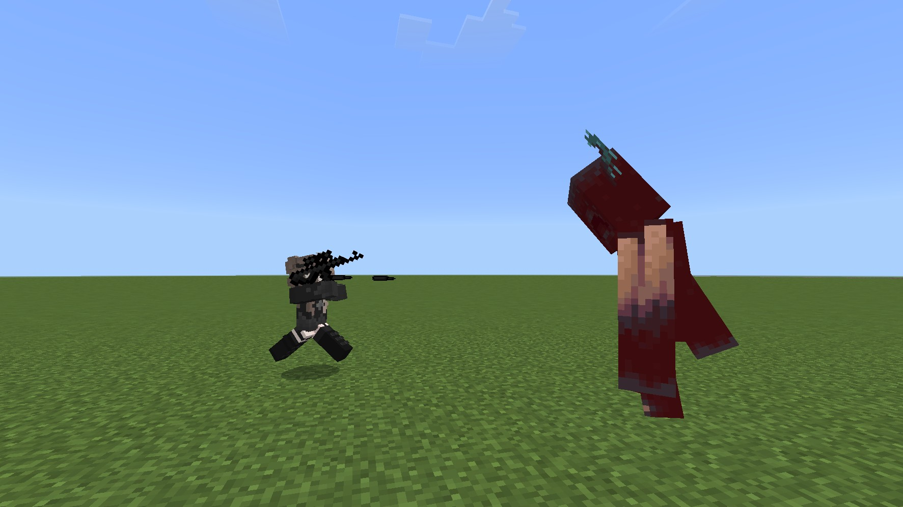

Use Cards (1/2/3) to tame allied characters of varying qualities, bringing them into battle, or 
assigning some characters, such as DM34 (the maid), to perform cooking, farming, lighting, and storage 
tasks.

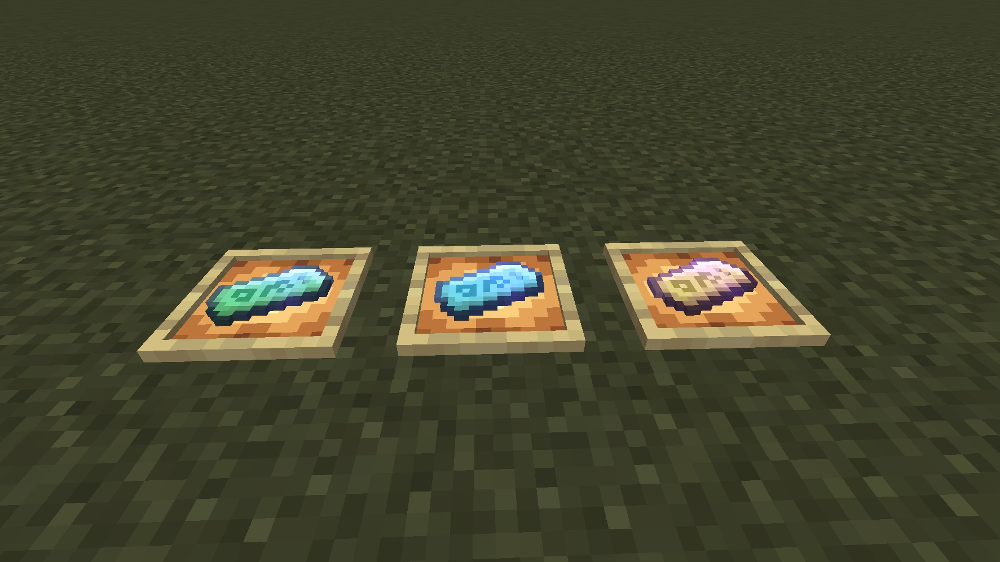

## Combat  
A significant portion of allied units possess skills, some even have several sets of entirely different skills. These can range from large-scale area-of-effect attacks, or explosive demolition skills, to directly teleporting and locking onto an enemy for a point-blank slash, and even summoning lightning strikes!

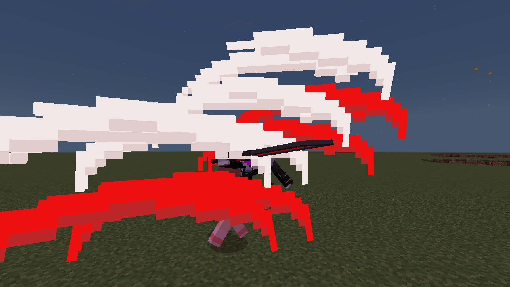

Here, take DM0 as an example. DM0 is an exceptionally versatile allied operator who excels in both ranged and melee combat. After landing 5 basic attacks (whether ranged or melee), she gains a 5-hit follow-up combo of the corresponding attack type with massively boosted damage. Once the 5-hit combo is complete, she returns to her basic attacks, and the cycle repeats. When her ultimate ability is activated, she immediately selects the nearest enemy within range and executes a point-blank slashing assault for 10 seconds, during which she is completely invincible! Use your allies wisely—they can turn the tide of battle!

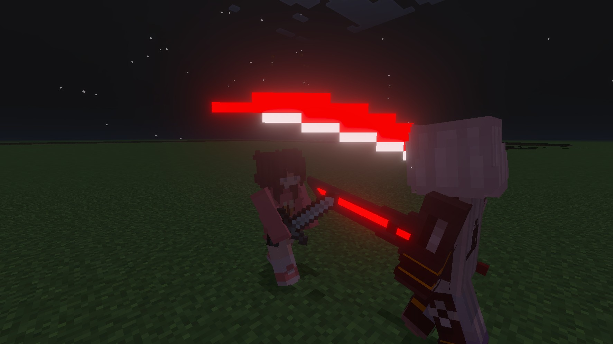
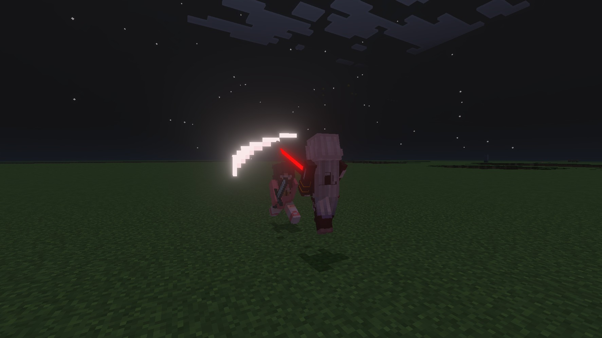
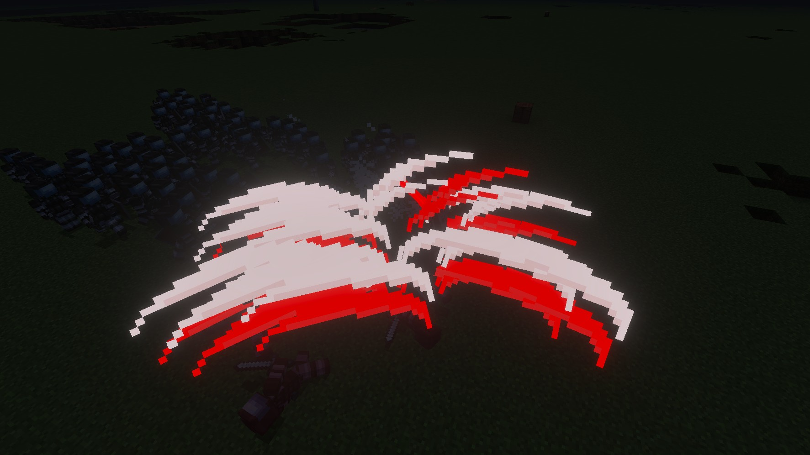

Of course, the game also features formidable enemy units that will actively attack players, villagers, and allied units from the addon. Many of their attacks deal large-scale explosive damage, capable of flattening your beloved builds in seconds! To be safe, do not use this addon on a world save you haven't backed up!

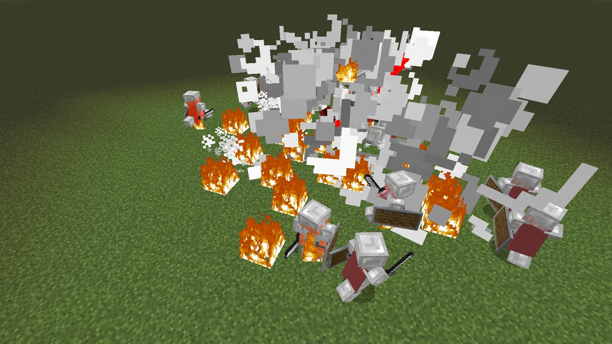

## Interaction
In this addon, certain characters offer additional interactive actions. Here, we'll take DM34, the maid, as an example. The maid has two forms: the Standard Maid and the Armory Maid. As a Standard Maid, she has three combat modes. Right-click her with a vanilla iron sword, bow, or crossbow, and she will equip the corresponding weapon and enter combat mode. The Standard Maid also has two logistics-oriented modes. Right-click her with raw food to directly activate cooking mode; sneak and right-click to receive cooked food. Right-click her with an iron hoe to activate farming mode, where she will search for nearby farmland to cultivate. The maid can use bone meal and can also harvest whole-block crops like pumpkins and melons.

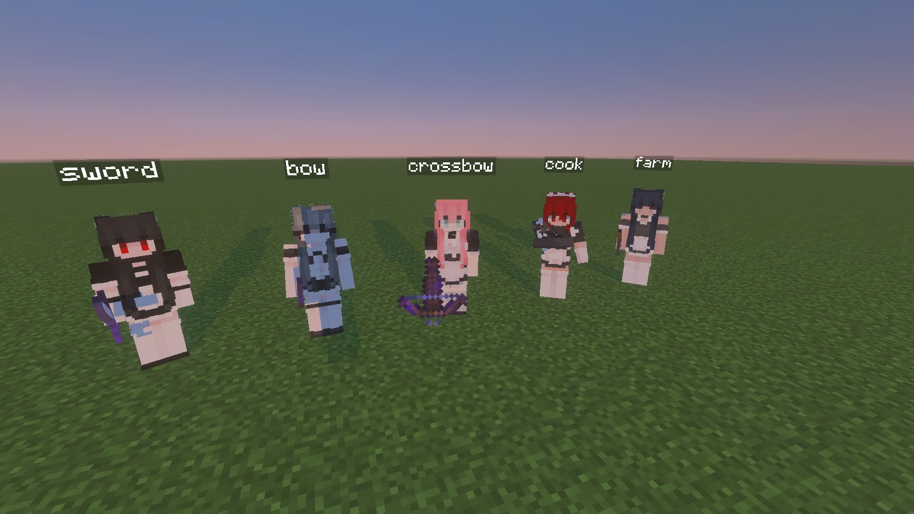

When the Standard Maid is unarmed and idle, right-click her with iron armor to have her equip it. Use the "Maid_command" item while sneaking and right-clicking to remove her armor.

Still with the Standard Maid unarmed, use the special item "War_cross" to promote her into the combat-specialized Armory Maid. The Armory Maid boasts incredibly powerful stats. Right-click her with various craftable modules to equip her with weapons—for example, the "Module-M4A1" equips her with an M4A1 rifle for combat. Conversely, with the Armory Maid unarmed, right-click her with "Gentle_cross" to revert her back to a Standard Maid.

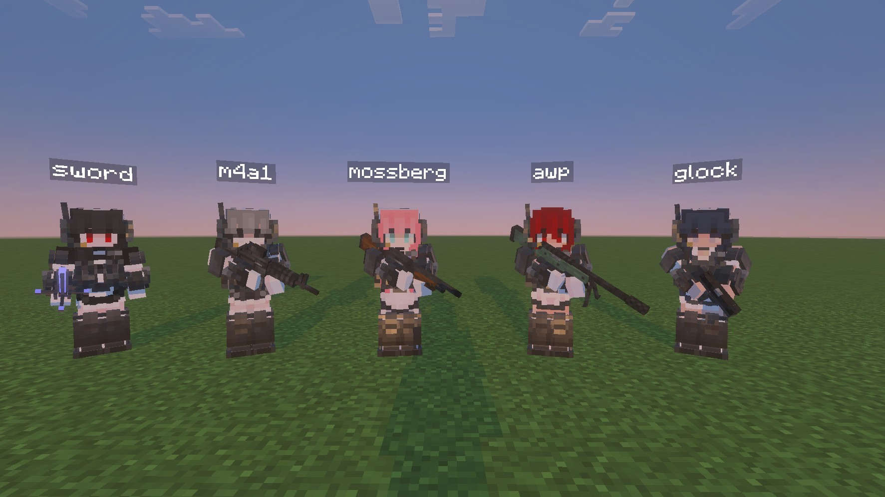
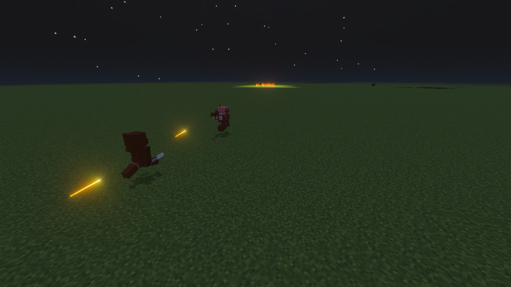

The "Maid_command" is an all-purpose tool you receive upon taming a maid. Holding this item or placing it in the maid's inventory will make her follow you!

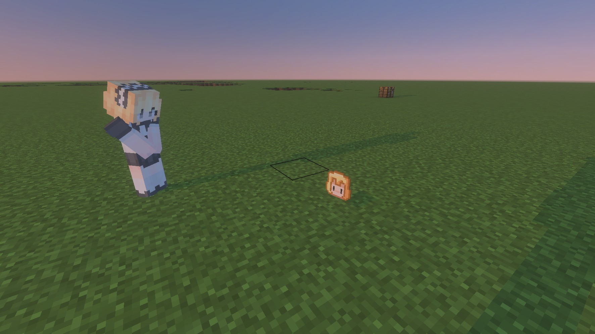

There are also other fun features, such as placing a torch in her inventory to make her glow! Or placing a saddle to ride the maid. Players can also hold a saddle and right-click to carry the maid. There are many more features for you to discover!

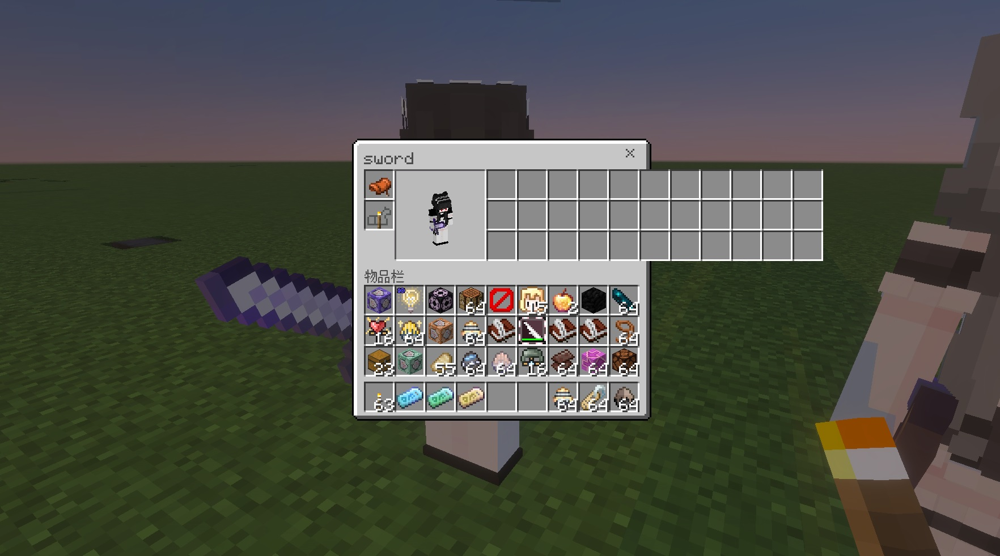
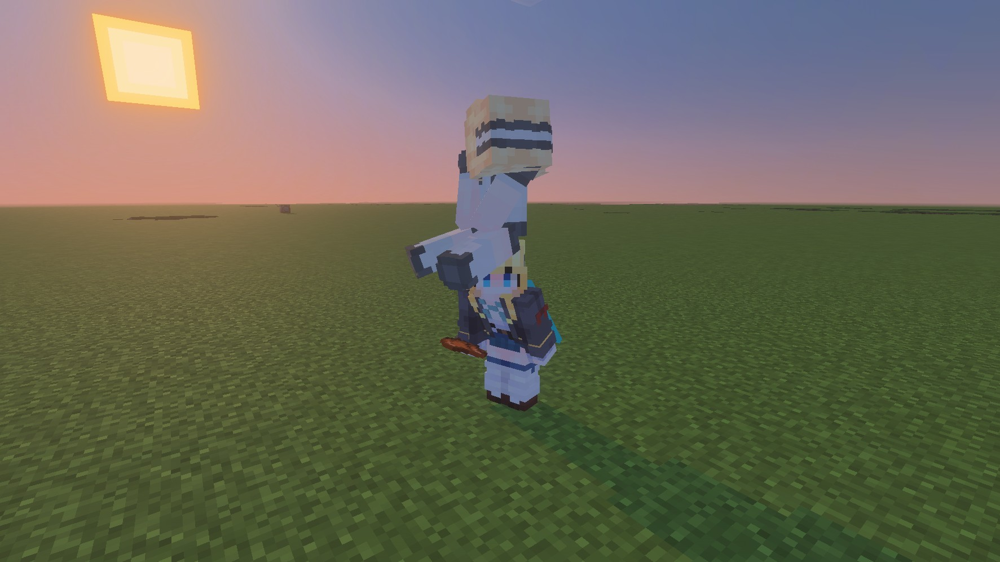